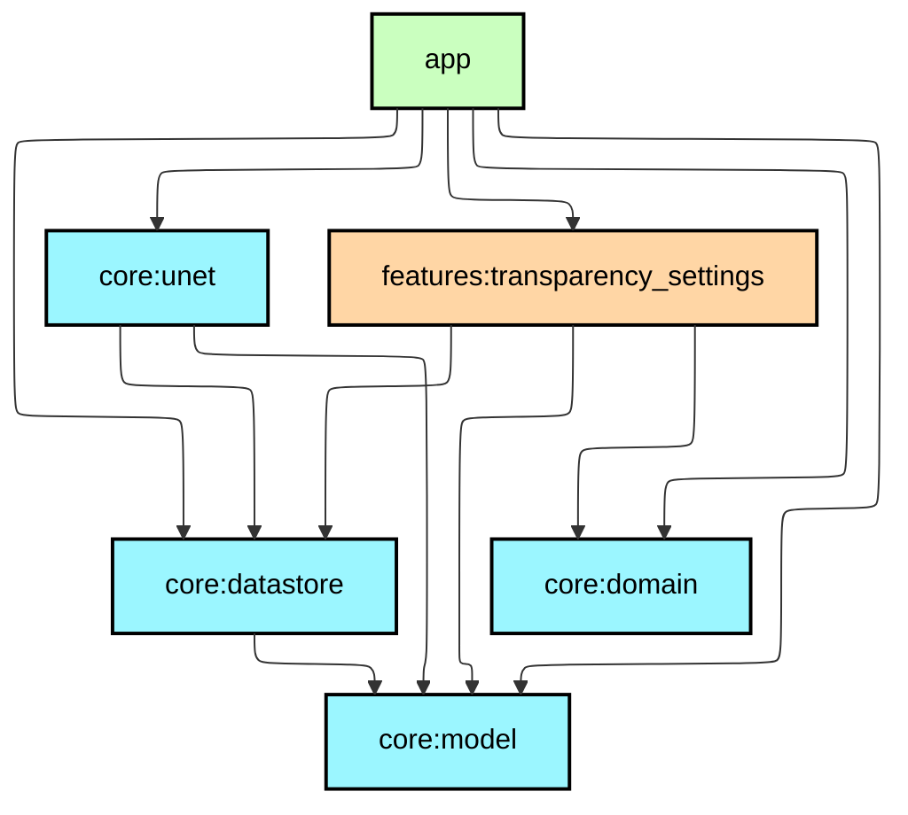
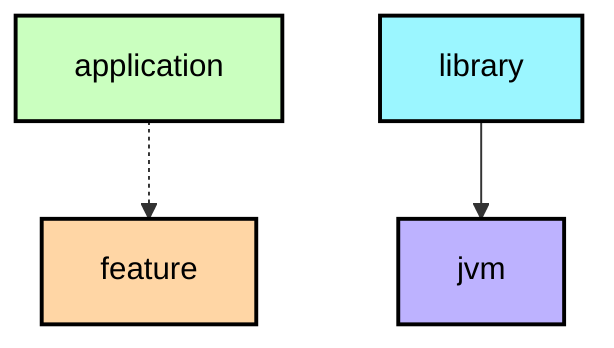

# UnetClass (U-Net Image Segmentation)

A powerful Android application for **semantic image segmentation** using **U-Net neural networks** with support for multiple inference engines (**PyTorch Mobile** and **TensorFlow Lite**). Designed for scientific visualization of cellular structures in microscopy images.

## 🎯 Overview

**UnetClass** is a production-ready Android application that performs real-time image segmentation using U-Net models. The app processes microscopy images and identifies **6 different cellular structures**:

- **Mitochondria** - Cellular energy producers
- **PSD** (Postsynaptic Density) - Synaptic connection markers
- **Vesicles** - Cellular transport containers
- **Axon** - Nerve fiber structures
- **Boundaries** - Cell borders
- **Mitochondrial Boundaries** - Mitochondria membranes

The application features a **modular Clean Architecture** with multiple ML backends, dependency injection via Hilt, and tiled inference for handling high-resolution images efficiently.

## 🏗️ Architecture

### Module Structure

This project follows a **multi-module architecture** for better separation of concerns, reusability, and build times:

```
UnetClass/
├── :app                           # Android Application module
├── :core
│   ├── :core:model               # Domain models & data classes
│   ├── :core:domain              # Domain layer interfaces & use cases
│   ├── :core:datastore           # Data persistence & repositories
│   └── :core:unet                # ML inference engine (PyTorch & TFLite)
└── :features
    └── :features:transparency_settings  # Feature module for UI settings
```

## Module dependency graph

<!--region graph-->


<details><summary>📋 Graph legend</summary>



</details>
<!--endregion-->

### Module Details

| Module | Type | Description | Key Components |
|--------|------|-------------|----------------|
| **`:app`** | Android Application | Main app with UI, ViewModels, navigation & Hilt setup | `MainActivity`, `MainViewModel`, Use Cases |
| **`:core:unet`** | Android Library | Dual ML inference engine (PyTorch + TFLite) with tiled processing | `UnetModel`, `PyTorchModel`, `TFLiteModel`, `SplitImageIntoTilesUseCase` |
| **`:core:model`** | Android Library | Shared domain models & data classes | `Tile`, `ImageData`, `PredictedClasses`, `TransparencyState`, `ResultState` |
| **`:core:datastore`** | Android Library | Data persistence & repository implementations | `ImageRepository`, `PredictionHistoryRepository`, `ImageSaver` |
| **`:core:domain`** | Android Library | Pure Kotlin domain layer with business logic | `Router` interface |
| **`:features:transparency_settings`** | Android Feature | UI for adjusting class visualization opacities | `TransparencySettingsActivity`, `TransparencyViewModel` |

> ⚠️ **Architecture Refactoring In Progress**  
> Currently, some modules violate strict Clean Architecture principles (e.g., `:features:transparency_settings` and `:core:unet` depend directly on `:core:datastore`). Active work is underway to eliminate these dependencies by introducing proper domain interfaces and ensuring feature modules only depend on the domain layer, not data implementations.
>
> 🔧 **Feature Extraction In Progress**  
> The `:app` module still contains several features that should be extracted into dedicated feature modules:
> - **Detail View** (`features.detail`) - Display individual class masks from prediction results
> - **Fullscreen View** (`features.fullscreen`) - Zoomable image viewer with PhotoView
> - **History Component** (`presentation.HistoryAdapter`) - Prediction history list UI  
> These will be progressively moved to separate `:features:*` modules to reduce `:app` module coupling and improve modularity.

## 🚀 Supported Inference Engines

| Engine | Backend | Acceleration | Status | Model File |
| :--- | :--- | :--- | :---: | :--- |
| **PyTorch Mobile** | `PyTorchModel` | CPU | ✅ Active | `traced_model.pt` |
| **TensorFlow Lite** | `TFLiteModel` | GPU (LiteRT) | ✅ Active | `tiny_unet_v3.tflite` |

### Engine Features

**PyTorch Mobile:**
- Batch processing support
- Direct tensor manipulation
- Full PyTorch ecosystem access
- Model format: TorchScript (`.pt`)

**TensorFlow Lite with LiteRT:**
- GPU acceleration via Android LiteRT (formerly TFLite)
- ImageProcessor pipeline (normalization + grayscale conversion)
- Optimized for mobile deployment
- Model format: TFLite (`.tflite`)

## 🧠 Segmentation Pipeline

The image segmentation process follows these steps:

1. **Image Selection** - User selects microscopy image from gallery
2. **Preprocessing** - Convert to grayscale and normalize to [0, 1]
3. **Tile Splitting** - Divide image into 256x256 tiles with 32px overlap
4. **Inference** - Run each tile through selected ML model (PyTorch or TFLite)
5. **Stitching** - Combine tile predictions using overlap blending
6. **Label Generation** - Create masks for each of 6 classes
7. **Post-processing** - Generate united mask and save results
8. **Visualization** - Display with configurable transparency per class

## 📊 Performance Characteristics

Key performance metrics tracked:

1. **Execution Time** - Per-prediction inference time (ms), stored in history
2. **Tile Processing** - 256x256 tile size optimized for mobile GPU memory
3. **Overlap Strategy** - 32px shift reduces edge artifacts in stitched results
4. **Memory Efficiency** - Tiled approach allows processing large images on devices with limited RAM

## 🛠️ Tech Stack

- **Language**: Kotlin
- **Architecture**: Clean Architecture + MVVM
- **Dependency Injection**: Dagger Hilt
- **ML Frameworks**: 
  - PyTorch Mobile (`org.pytorch:pytorch_android`)
  - TensorFlow Lite (`com.google.ai.edge.litert`)
- **Image Loading**: Glide + PhotoView
- **Async Processing**: Kotlin Coroutines
- **UI**: View Binding, RecyclerView
- **Min SDK**: 24 (Android 7.0)
- **Target SDK**: 34
- **Compile SDK**: 36
- **JVM Target**: 17

## 🔌 Dependencies

### ML Inference
```kotlin
// PyTorch Mobile
implementation(libs.pytorch.android)
implementation(libs.pytorch.android.torchvision)

// TensorFlow Lite / LiteRT
implementation(libs.litert)
implementation(libs.litert.gpu.api)
```

### Dependency Injection
```kotlin
// Dagger Hilt
implementation(libs.hilt.android)
ksp(libs.hilt.compiler)
```

### Image Processing
```kotlin
// Glide
implementation(libs.glide)
annotationProcessor(libs.compiler)

// PhotoView (image zoom)
implementation(libs.photoview)
```

### AndroidX & UI
```kotlin
implementation(libs.androidx.core.ktx)
implementation(libs.androidx.appcompat)
implementation(libs.material)
implementation(libs.androidx.lifecycle.viewmodel.ktx)
implementation(libs.androidx.activity.ktx)
implementation(libs.work.runtime)
```

## 🚀 Getting Started

### Prerequisites
- Android Studio (latest stable)
- JDK 17
- Android SDK 36 (compile), 34 (target)
- Minimum Android 7.0 (API 24)

### Build & Run

```bash
# Clone the repository
git clone <repository-url>
cd UnetClassApplication/UnetApplication

# Build the project
./gradlew assembleDebug

# Install on device
./gradlew installDebug
```

### Model Files

Place the following model files in the `core/unet/src/main/assets/` directory:

- `traced_model.pt` - PyTorch TorchScript model
- `tiny_unet_v3.tflite` - TensorFlow Lite model

These models should be trained on cellular structure segmentation with 6 output classes.

## 📱 Usage

1. **Launch the app** and tap "Select Image"
2. **Choose a microscopy image** from your gallery
3. **Tap "Predict"** to run segmentation
4. **View results** - The segmented image will be displayed
5. **Adjust transparency** - Open settings to tweak visibility of each class
6. **Browse history** - Previous predictions are saved and accessible
7. **View details** - Tap "More Info" to see individual class masks

## 🧪 Testing

```bash
# Run unit tests
./gradlew test

# Run instrumented tests
./gradlew connectedAndroidTest

# Run lint checks
./gradlew lint
```

## 🔮 Future Enhancements

- [ ] Export results in multiple formats (PNG, TIFF, NIfTI)
- [ ] Cloud model synchronization
- [ ] Custom model import
- [ ] Batch processing mode
- [ ] 3D volume visualization
- [ ] Quantitative analysis tools (area, count measurements)

## 📄 License

This project structure is designed for educational and research purposes in the field of biomedical image analysis.

## 👥 Contributing

Contributions are welcome! Please feel free to submit a Pull Request.

## 📞 Contact

For questions or support, please open an issue in the repository.

---

**Built with ❤️ for scientific community using Kotlin, PyTorch Mobile, and TensorFlow Lite**
